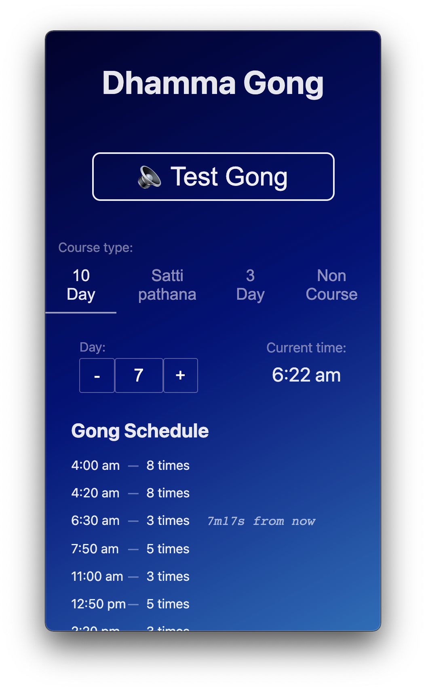

# Web-based AutoGong

An automated system to run all the gongs during a [dhamma.org](https://dhamma.org) course.



## 1st Version Requirements

- [x] 1. A test button to play gong anytime, to check the quality and sound of output from speaker.
- [x] 2. Show the current time
- [x] 3. Select the type of course
    a. 10 Day
    b. Sattipatthana (7 Day)
    c. 3 Day
    d. Non Course
- [x] 4. Show the gong schedule for that course
- [x] 5. Show adjustable course Day
- [x] 6. Custom gong schedules on Vipassana Days & for Non Course days
- [x] 7. Play the right # of gongs, automatically at the scheduled time
- [x] 8. Highlight next gong w/ countdown, or if currently playing, how many have played already
- [x] 9. System should able to run offline once installed
- [x] 10. Link to app's source code
- [x] 11. Link to review or Report Issue, if anything not working
- [x] 12. Detect & warn about incompatibility if they're using Safari, which blocks scheduled audio
- [ ] 13. Play doha's according to the day of the course
- [ ] 14. Play random doha each day for Non Courses

### With above complete, can fully automate 1 day

- [ ] 15. Automatically increment the Day counter at midnight

### With above complete, can fully automate 1 course

- [ ] 16. Show the current date
- [ ] 17. An option to schedule all year courses in format of day/month/year

### With above complete, can fully automate 1 year

- [ ] 18. A security passcode to lock settings
- [ ] 19. Better domain name than https://autogong.vercel.app/

### Unclear requirements:

- [ ] 20. If mobile goes off by any reason we need an autostart option for app.
- [ ] 21. Auto launch in mobile screen after unlock.


## Gong timings for 3-Day & 10-Day Courses

- 4 am - 8 times
- 4:20 am - 8 times
- 6:30 am - 3 times
- 6:35 am - Play doha according to day of courses.
- 7:50 am - 5 times
- 11:00 am - 3 times
- 12:50 pm - 5 times
- 2:20 pm - 3 times
- 5:00 pm - 3 times
- 5:50 pm - 5 times

### On Day 4:

We need to change afternoon bell timings.

Instead of 2:20pm, it will be at 1:50pm -3 times (for group sitting) and next bell will be at 5:00pm (for tea break).

## Sattipatthana Course

All timings are like 10-day courses except on day 3 it’s Vipassana Day, so bell timings will be like day 4 of 10 day.

## Non Course Days Schedule

1. 5:00 am - 5 times
2. 6:30 am - 3 times
    - Play random doha’s after 3 bells.
3. 7:50 am - 5 times
4. 9:00 am - 3 times
5. 11:00 am - 3 times
6. 2:00 pm - 3 times
7. 3:00 pm - 3 times
8. 5:00 pm - 3 times
9. 5:50 pm - 3 times
10. 7:00 pm - 3 times

---

# Development

## Getting Started

First time, install dependencies

```bash
yarn
```

Then start the development server:

```bash
yarn dev
```

Open [http://localhost:3000](http://localhost:3000) with your browser to see the result.

You can start editing the page by modifying `pages/index.tsx`. The page auto-updates as you edit the file.

## Learn More

To learn more about Next.js, take a look at the following resources:

- [Next.js Documentation](https://nextjs.org/docs) - learn about Next.js features and API.
- [Learn Next.js](https://nextjs.org/learn) - an interactive Next.js tutorial.
